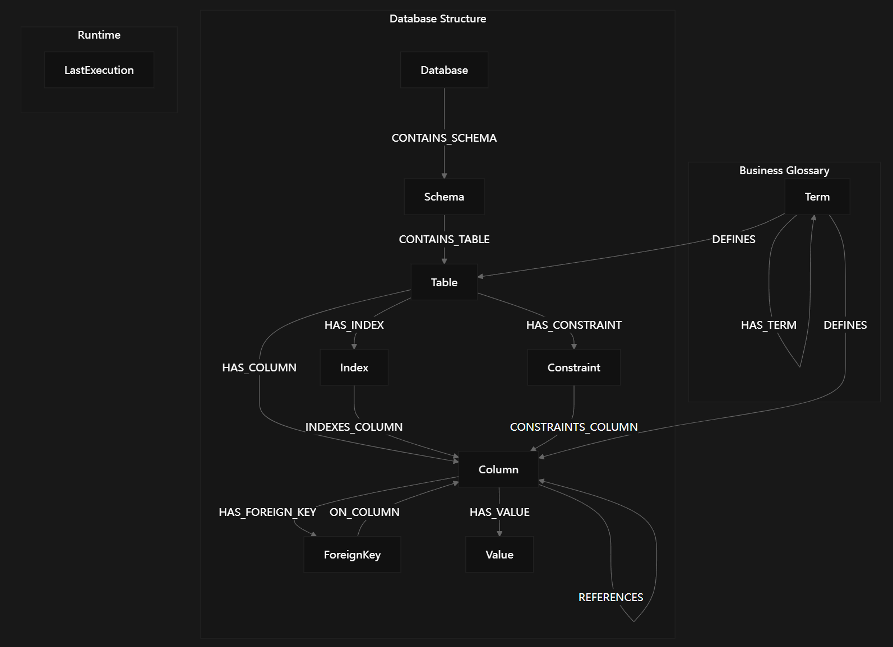

# reference
- [How a Neo4j semantic layer makes your Text-to-SQL agent smarter and cheaper](https://neo4j.com/blog/agentic-ai/how-a-neo4j-semantic-layer-makes-your-text-to-sql-agent-smarter-and-cheaper/)
- https://github.com/ltndn4j/neo4j_text2SQL
- https://deepwiki.com/ltndn4j/neo4j_text2SQL

# 概述
- text-to-sql/data-agent领域，语义层主流是通过dbt来构建；而`neo4j_text2SQL`与众不同，使用Neo4j作为语义层，通过embedding语义+graph的多跳方式完成schema linking。本文对其技术实现进行拆解。

# Why Neo4j semantic layer?
- 标准的Text-to-SQL实现为LLM提供完整的数据库schema，会导致几个问题：
    1. 上下文噪声，导致幻觉和准确性下降
    2. Token使用多，价格贵速度慢
- 为了解决这些问题，`neo4j_text2SQL`使用Neo4j作为动态语义层，引入GraphRAG

# Architecture
- 组件包括:
  - 命令行入口: `neo4j_text2sql_cli.py`
  - 前端: Streamlit
  - 后端: FastAPI
  - 数据库: PostgreSQL
  - 语义层: Neo4j
  - Agent: LangChain, LangGraph
- 外部: embedding模型以及chat模型
- 数据在`data`目录中，包括
  1. 数据库schema
  2. 数据
  3. 业务术语表
  4. 历史查询日志
  5. 参考问题以及golden SQL

# Agent
- [Query Execution Pipeline](https://deepwiki.com/ltndn4j/neo4j_text2SQL/1.1-architecture-and-design-philosophy#query-execution-pipeline)

- 本人只在24年底使用过LangChain，当时觉得很难用。现在LangChain似乎已经发生了大改变。

- `agent.py`中
  - 通过`langchain.agents.create_agent`创建agent，这不是一个Workflow，是一个LangChain ReAct Loop。
  - 本项目的tools包括`db_tools`, `static_context_tools`, `semantic_layer_tools`
- `main.py`中
  - 调用agent的`invoke`方法，得到字典对象result

# Neo4j Semantic Layer
## schema

- 图中的schema是写死固定的，相较Ontology的做法更轻量化。

## loading
- [Data Flow Overview](https://deepwiki.com/ltndn4j/neo4j_text2SQL/3.2-semantic-layer-data-loading#data-flow-overview)

## GraphRAG
- [Semantic Retieval Pipeline](https://deepwiki.com/ltndn4j/neo4j_text2SQL/2.3.2-semantic-layer-tool-(semanticlayertool.py)#tool-data-flow-language-to-graph-entities)

- 三个Cypher语句
  1. 多渠道语义召回相关Column节点 + 计算表间最短关联路径
  2. 找到join key + 元数据补全聚合 + 结果格式化
  3. 持久化执行上下文，作为缓存使用
- 前两个语句完成了自然语言到相关表、字段、定义、样例值、join路径的转换
- 语句更具体让豆包解释，这里就不赘述了

# Accuracy
- 使用LLM as a judge方法，通过比较agent生成SQL与手动定义SQL进行计算。

# 个人调试中的改造/问题
- 我使用docker-compose容器化postgres, neo4j
- 我只有GPT plus账号，也不想开openai账号，做了如下改造
  - embedding模型，使用本地V100显卡serve的`BAAI/bge-m3`
  - chat模型，使用本地的`omniroute`
- 修改chat模型后，会导致`langchain_openai.chat_models.base#apply_langchain_openai_compat`中`normalized_token_usage`出现异常，异常会被吞。需要修复
- `semanticLayerTool`中agent_embedding这行有typo

# What's next?
- [作者提到的一些改进点](https://github.com/ltndn4j/neo4j_text2SQL#improvements)
- 本文的数据集，共有18个库50张表253个字段54组外键，schema有一定复杂度。可惜自带的`reference_questions.json`中只有3个问题，说服力不够，难以证明在复杂schema场景下Graph作为Semantic Layer比YAML更好。
- PostgreSQL在国内用得比较少吧，项目中用到了一些PostgreSQL的专属特性；而MySQL, StarRocks等更适合中国宝宝体质。设计图schema时需要尽可能做成通用的，并且需要建立一层db adapter抽象来摄取图数据。
- 整理`business_glossary.json`也要花不少时间。语义层可以做成compounding的：Agent在被使用中理解被澄清的语义后将其融入Neo4j语义层。在企业级应用中还需要考虑如何控制语义层的权限。
- `neo4j_text2SQL`借鉴了`neocarta`的做法，下一篇展开讲`neocarta`并进行对比。
- 260626: [[neocarta]]已发布

