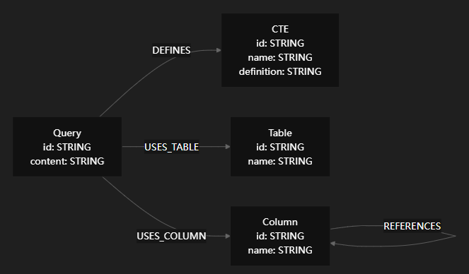

# reference
- [Build a graph-based semantic layer from GCP with Neocarta](https://neo4j.com/blog/genai/build-a-semantic-layer-from-gcp-with-neocarta/)
- https://github.com/neo4j-labs/neocarta
- https://deepwiki.com/neo4j-labs/neocarta

# Overview
- 上篇请见[[neo4j-text2sql]]

- `neocarta`
- 项目定位：一个end-to-end的Neo4j semantic layer构建库，通过MCP server提供给agent使用。
- 项目发展情况：快速发展中，[暂定260710正式公开大版本](https://github.com/neo4j-labs/neocarta/milestone/1)。
- 项目名称含义：neo肯定是Neo4j啦，而carta是中世纪拉丁语中的“地图”。

# What's more in README.md?
- 语义层内容
  1. schema元数据
  2. 业务术语表
  3. 指标
  4. 历史SQL
- Connector用于摄入schema元数据，包括双向[[open-semantic-interchange]], BigQuery Schema/Logs, GCP Dataplex Universal Catalog, Query Logs, CSV Files。[v0.8.0还新增了JDBC](https://github.com/neo4j-labs/neocarta/releases/tag/neocarta-v0.8.0)。
- Embeddings提供LiteLLM, OpenAI-compatible两种方式
- 提供CLI以
  1. 执行ingest命令
  2. 直接调用MCP server tools进行查询
- MCP

# end-to-end
- [neo4j的blog](https://neo4j.com/blog/genai/build-a-semantic-layer-from-gcp-with-neocarta/)中以GCP为例，端到端搭建语义层大致包含以下几步
  1. neo4j实例及权限配置
  2. uv创建py环境
  3. 配置google大数据组件环境变量
  4. 执行cli命令，完成schema ingestion
  5. 配置BigQuery MCP
  6. `make agent`启动agent CLI，即可开始自助查询

# Graph Data Model




# RAG
- 自底而上：`neocarta/_mcp/cypher`中有不同的tool
- 自顶向下：`neocarta/_mcp/server`中有不同的strategy

- 策略是怎么确定的？
  - 策略粒度：Table, Column分别有一个策略
  - 自动检测是否存在向量索引、全文索引、业务术语全文索引，并registry对应的tool

- 核心GQL语句在`neocarta/_mcp/cypher/hybrid_search.py`中的`get_context_by_table_business_term_hybrid_search_cypher`, `get_context_by_column_business_term_hybrid_search_cypher`方法中
- 同
  - 入参: queryEmbedding, queryText, searchTopK, maxTables
  - 混合召回: 向量相似度+全文检索
  - 分数归一化，两路取MAX: 归一化向量相似度、表文本匹配度、业务术语文本匹配度
  - 补齐database, schema, foreign key, query等元数据
- 异
  - table和column的差异
  - 打分: 同一表取最高分; 匹配字段平均分

- 没有传统RAG的reranker，而是在Cypher语句中通过分数归一化和合并策略直接完成了排序

# Neo4j indexes
- 向量索引、全文索引的provider是lucene+native-1.0
- 向量索引: HNSW + 7bit SQ + cosine, dimensions <= 4096
- 全文索引: 倒排索引 + BM25F

# Eval
- Retrieval Metrics包括
  1. Object Recall
  2. Object Precision
  3. Missing Objects
- SQL Accuracy and Faithfulness
  1. Structural Equivalence: 通过`sqlglot`完成SQL AST树比较
  2. Execution Accuracy: 比较result sets
  3. Schema Faithfulness

# `neocarta` vs `neo4j_text2sql`
- 项目定位差异
  - `neocarta`: 端到端构建Neo4j语义层，更偏工程化
  - `neo4j_text2sql`: 一个包含前端的可演示的demo
- Neo4j Semantic Layer的差异
  - `neo4j_text2sql`: 包含 DB schema 与 业务术语
  - `neocarta`: 额外还有 查询日志，并且 业务术语 的schema更丰富

# `neocarta` vs `open-semantic-interchange`
- https://github.com/neo4j-labs/neocarta/blob/main/neocarta/data_model/osi/README.md

deepwiki总结：
```
维度	Neocarta 原生 Schema	OSI Schema
目的	描述物理数据库结构 + 业务词汇 + 查询血缘	描述业务语义模型（指标、维度、Join 逻辑）
来源	BigQuery/JDBC/Dataplex/CSV 等连接器提取	OSI YAML 文件（本地或 URL）
Table/Column	原生 Table/Column 节点	OsiTable/OsiColumn（继承原生，多标签存储）
指标定义	无	Metric + Expression（方言级别的计算表达式）
Join 定义	仅 REFERENCES（外键，列级别）	Join 节点（含有序 from_columns/to_columns，支持复合键）
AI 上下文	无	OsiAiContext（instructions/synonyms/examples）
BusinessTerm	来自 Dataplex Glossary，通过 TAGGED_WITH 关联	来自 ai_context.synonyms，MERGE on name，与原生 BT 去重
双向性	仅 ingest（单向写入）	支持 ingest + export（双向，可从 Neo4j 导出回 YAML）
Query 节点	来自查询日志，记录历史 SQL	来自 OSI dataset source 为 SQL 时，记录逻辑查询定义
```

- Neocarta > OSI的部分
  - Column的采样值: Value节点
  - 查询日志血缘: Query, CTE节点

# What's next?
- 开源生态发展。`neocarta`已经支持[[unitycatalog]]目录标准，也支持[[open-semantic-interchange]]语义数据交换标准的导入导出，[1.0版本OSI还会被集成至MCP中](https://github.com/neo4j-labs/neocarta/issues/189)。
- 找一个公认的benchmark数据集，观察Neo4j Semantic Layer相较YAML所带来的提升。
- 作为一个端到端项目，“端”的生态发展还在早期。[目前支持Google BigQuery的schema/logs ingestion](https://github.com/neo4j-labs/neocarta/tree/main/neocarta/connectors/bigquery)。还不支持[Databricks](https://github.com/neo4j-labs/neocarta/issues/106), [Snowflake](https://github.com/neo4j-labs/neocarta/issues/107)。对接国内的主流/自研生态的话，还有一些语义层及查询日志的接入适配工作。
- 作为一个企业级项目，observability, guardrails, 身份权限管理还有待提升。

